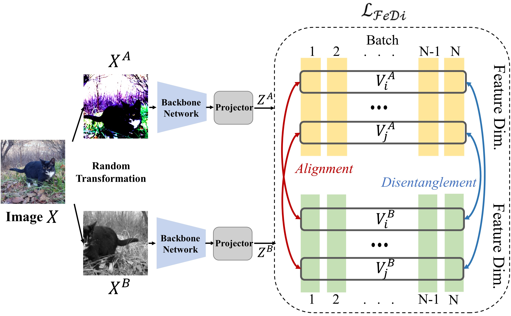

# FeDi: Self-supervised Learning via Feature Disentanglement
This is a PyTorch implementation of FeDi. 

## Introduction



Self-supervised learning (SSL) has revolutionized the field of deep learning by enabling the extraction of meaningful representations from unlabeled data. In this work, we introduce FeDi, a novel SSL method that leverages feature disentanglement to enhance the quality and robustness of learned representations. FeDi maximizes the lower bound on mutual information between representation vectors across batch dimensions, effectively disentangling features and preventing representation collapse. Our proposed method serves as a hardness-aware loss function that automatically balances alignment and disentanglement terms, effectively managing the challenges of disentangling high-dimensional representations. Our extensive experiments demonstrate that FeDi consistently outperforms state-of-the-art SSL methods across a variety of tasks, including image classification, object detection, and segmentation. Moreover, FeDi exhibits strong transferability and adaptability, maintaining superior performance across different network architectures and training conditions.


## Installation

We perform self-supervised pre-training using the proposed FeDi method on [ImageNet ILSVRC-2012 dataset](https://www.image-net.org/challenges/LSVRC/2012/). Please prepare the dataset accordingly. This codebase is tested in the following environments and should also be compatible for later versions.

* Ubuntu 20.04
* Python 3.9
* [PyTorch](https://pytorch.org) 1.12.0
* [Torchvision](https://pytorch.org)  0.17.2
* cudatoolkit 11.3


## Pretraining

To do self-supervised pre-training of a ResNet-50 model for 100 epochs using an 8-gpu machine, simply run:

```bash
$ bash pretrain.sh
```

## Linear Probing

To evaluate the pre-trained models by linear probing, simply run:

```bash
$ bash benchmarks/linearprob/linear.sh
```

## Acknowledgement

This repo is mainly based on [MEC](https://github.com/xinliu20/MEC) and shares the same spirit that aims to make minimal modifications on [the official PyTorch ImageNet training code](https://github.com/pytorch/examples/tree/master/imagenet). Many thanks to their wonderful work!

# fedi
